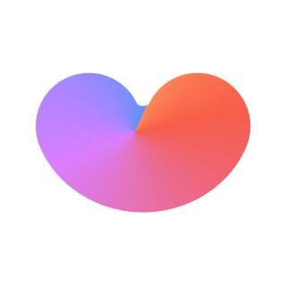

<div align="center">
  <br />
  
  <h1>두굿모닝(Do Good morning)</h1>
  <a href="#">
  <!--  -->
  </a>
  <br />
</div>

## 목차

1. [**웹 서비스 소개**](#1)
2. [**기술 스택**](#2)
3. [**주요 기능**](#3)
4. [**주요 페이지**](#4)
5. [**개발 일정**](#5)
6. [**실행 방법**](#6)

<br />

<div id="1"></div>

## 💁🏻‍♂ 웹 서비스 소개

&nbsp;&nbsp;웹 서비스 소개란입니다.

<br />

[**🔗 배포된 웹 서비스로 바로가기 Click !**](#) 👈

> 새 창 열기 방법 : CTRL+click (on Windows and Linux) | CMD+click (on MacOS)

<br />

<div id="2"></div>

## 🛠 기술 스택

**Front-end**

-   
- 
- 

**Back-end**

- 
- 

**ETC**

-  

<br />

<div id="3"></div>

## 💡 주요 기능

- 기능 1
- 기능 2
- 기능 3

<br />

<div id="4"></div>

## 📄 주요 페이지

<br />

<div id="5"></div>

## 📅 개발 일정

<br />

<div id="6"></div>

## 💻 실행 방법

1. **서버**

```bash
$export FLASK_APP=back
$export FLASK_ENV=development
$flask run
```

2. **실행 2**

```bash
$
```

3. **실행 3**

```bash
$
```
