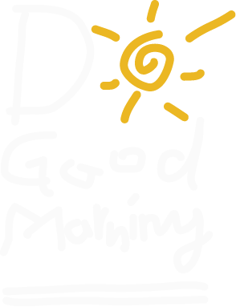
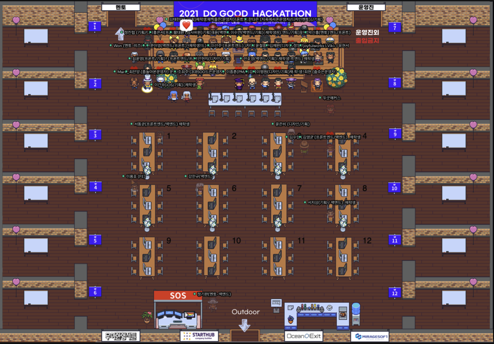
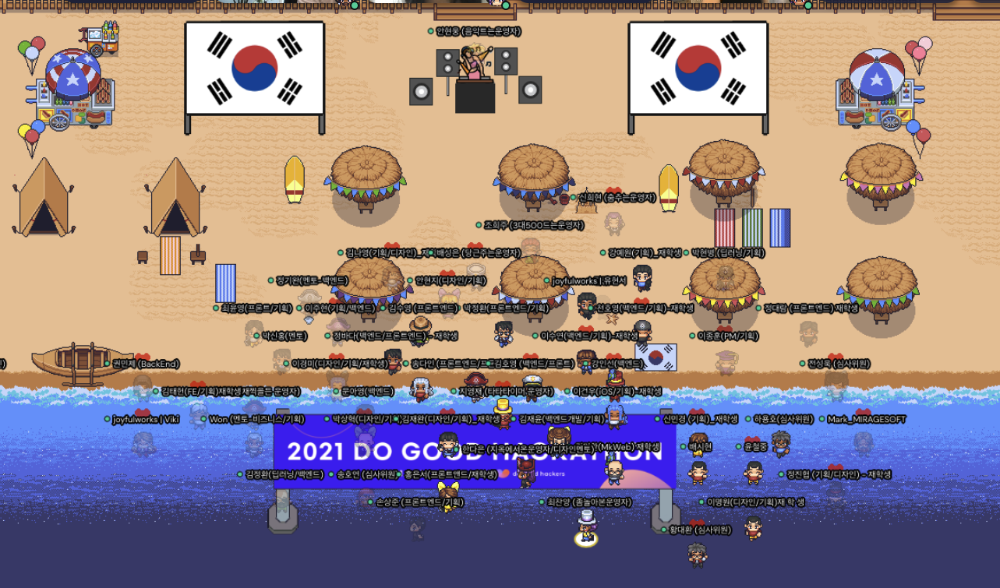
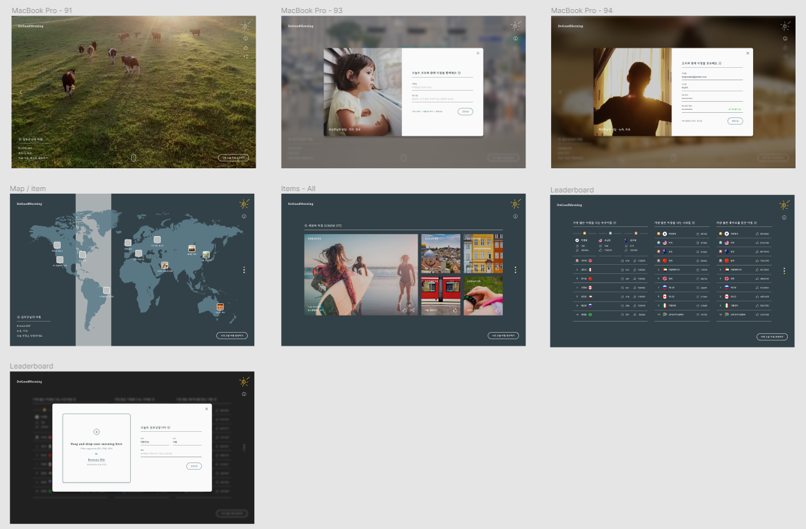
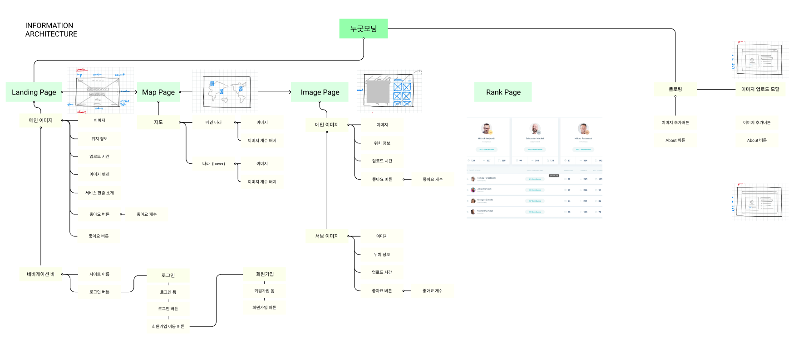
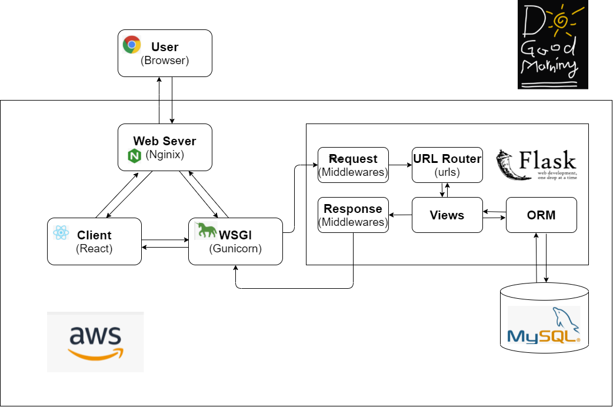
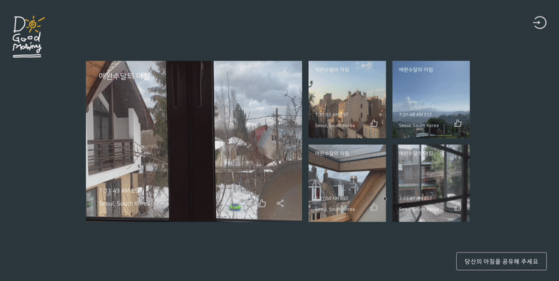

<div align="center">
  <br />
  
  <h1>두굿모닝 (Do Good morning)</h1>
  
  <br />
</div>

## 목차

1. [**프로젝트 진행 배경**](#1)
1. [**웹 서비스 소개**](#2)
1. [**기술 스택**](#3)
1. [**주요 기능**](#4)
1. [**프로젝트 구성도**](#5)
1. [**주요 페이지 및 기능 소개**](#6)
1. [**팀 소개**](#7)
1. [**개발 기간**](#8)
1. [**실행 방법**](#9)

<br />

<div id="1"></div>

## 🔅 프로젝트 진행 배경

&nbsp;&nbsp;**두굿해커톤**(Do Good Hackathon)에 참여하여 진행한 프로젝트 입니다.

&nbsp;&nbsp;두굿해커톤 규칙에 따라 개발은 `08.14.(토) 10:00AM ~ 08.15.(일) 11:00AM [25시간]` 이라는 단시간 동안 진행한 프로젝트입니다.


### 해커톤 주제

- 코로나로 인해 어려움을 겪는 전세계 로컬 비즈니스 지원 서비스
- 가족이나 친구와의 심적 거리를 좁혀주는 새로운 소통/커머스 서비스
- 나와 내 커뮤니티의 몸과 마음을 건강하게 해주는 디지털 웰빙/힐링 서비스

|  |  |
| :----------------------------------------------------------------------: | :----------------------------------------------------------------------: |

<br />

[**🔗 2021 두굿해커톤 링크 Click !**](https://event-us.kr/vqssceuidpw2/event/33708) 👈

> 새 창 열기 방법 : CTRL+click (on Windows and Linux) | CMD+click (on MacOS)

<br />

<div id="2"></div>

## 💁🏻‍♂ 웹 서비스 소개

&nbsp;&nbsp;서로의 아침 창밖 풍경을 공유해 두근거리는 아침 그리고 굿모닝을 실천하게 해주는 두굿모닝 서비스입니다.  
&nbsp;&nbsp;세계 각국에서 업로드하는 사진들을 통해 창밖 풍경 여행을 즐기실 수 있습니다.

<br />

<div id="3"></div>

## 🛠 기술 스택

**Front-end**

-   
- 
- 

**Back-end**

- 
- 
- 

**DevOps**

-  

-  

<br />

<div id="4"></div>

## 💡 주요 기능

- 사진 업로드와 멘션을 통한 아침 창밖 모습과 그날의 기분과 일정 공유
- 세계지도 UI를 통해 실시간 모닝존(AM 06:00 ~ 10:00) 위치를 확인하고 베스트 창문 컷 표기
- 세계 각국에서 올리는 게시물들을 다양한 기준으로 통계하여 랭킹으로 시각화

<br />

<div id="5"></div>

## 📂 프로젝트 구성도

| [🔗와이어프레임(Wireframe)](https://www.figma.com/file/jKUOxRV6PgkZcu8Ovkvvqf/DoGoodMorning?node-id=125%3A18) |
| :-----------------------------------------------------------------------------------------------------------: |
|                                                |

|                        스토리보드(Storyboard)                         |
| :-------------------------------------------------------------------: |
|  |

|                    아키텍처(Architecture)(Storyboard)                     |
| :-----------------------------------------------------------------------: |
|  |

<div id="6"></div>

## 📄 주요 페이지 및 기능 소개

|                             메인 페이지 (게시물 section)                              |
| :-----------------------------------------------------------------------------------: |
|  |

|                            메인 페이지 (세계지도 section)                             |
| :-----------------------------------------------------------------------------------: |
|  |

|                          메인 페이지 (베스트 게시물 section)                          |
| :-----------------------------------------------------------------------------------: |
|  |

|                              메인 페이지 (랭킹 section)                               |
| :-----------------------------------------------------------------------------------: |
|  |

|                          로그인 및 회원가입                           |
| :-------------------------------------------------------------------: |
|  |

|                              게시물 업로드                              |
| :---------------------------------------------------------------------: |
|  |

|                                마이페이지                                 |
| :-----------------------------------------------------------------------: |
|  |

<br />

<div id="7"></div>

## 👪 팀 소개

|  이름  |   역할    |                                                                                                                                       개발 내용                                                                                                                                        |
| :----: | :-------: | :------------------------------------------------------------------------------------------------------------------------------------------------------------------------------------------------------------------------------------------------------------------------------------: |
| 김수영 | Front-end |                                                                                                                                           -                                                                                                                                            |
| 박정환 | Front-end | **메인 페이지 (게시물 section)** 마크업 및 스타일링 작업<br />**메인 페이지 (베스트 게시물 section)** 마크업 및 스타일링 작업<br />**마이페이지** 마크업 및 스타일링 작업<br />**로그인 및 회원가입 모달** 마크업 및 스타일링 작업<br />**게시물 업로드 모달** 마크업 및 스타일링 작업 |
| 손상준 | Front-end |                                                             인포메이션 아키텍쳐 작성<br />메인 페이지 업로드 기능 개발<br />메인 페이지 게시물 기능 개발<br />세계지도 페이지 검색 기능 개발<br />베스트 게시물 기능 개발                                                              |
| 강인선 | Back-end  |                                                                                     서버 아키텍쳐 작성<br />DB설계<br />auth API개발<br />게시물 API개발(이미지, 좋아요 등)<br />리더보드 API개발                                                                                      |
| 이주현 | Back-end  |                                                                                                                                           -                                                                                                                                            |
| 윤은비 | Designer  |                                                                                                                                           -                                                                                                                                            |

<br />

<div id="8"></div>

## 📅 개발 기간

`08.14.(토) 10:00AM ~ 08.15.(일) 11:00AM [25시간]`

<br />

<div id="9"></div>

## 💻 실행 방법

1. **원격 저장소 복제**

```bash
$ git clone https://github.com/do-good-morning/do-good-morning.git
```

2. **프로젝트 폴더로 이동 후 서버 폴더로 이동**

```bash
$ cd do-good-morning
$ cd back
```

3. **서버 실행**

```bash
$ export FLASK_APP=back
$ export FLASK_ENV=development
$ flask run
```

4. **클라이언트 폴더로 이동**

```bash
$ cd client
```

> 새 창 터미널 열기 후

5. **필요한 node_modules 설치**

```bash
$ npm install
```

6. **리액트(클라이언트) 앱 실행**

```bash
$ npm start
```
